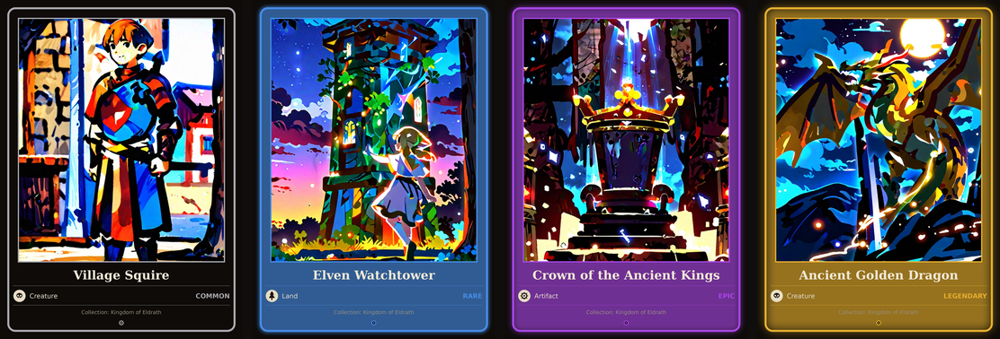

# DotCardGenerator

Turns raw artwork into finished DotCard card images: procedurally draws the
frame, rarity-driven border glow, type icon, and text — you only provide the
illustration.



*(COMMON → LEGENDARY, left to right — same template, escalating border glow.
These are real output from `GeneratedCards/`, generated from the sample
`cards.json` shipped in this repo.)*

## Setup

```bash
python3 -m venv .venv && source .venv/bin/activate   # optional but recommended
pip install -r requirements.txt
```

Best text rendering requires the DejaVu font family (already present on most
Linux distros). On Debian/Ubuntu, if missing:

```bash
sudo apt install fonts-dejavu-core
```

Without it, generation still works but falls back to PIL's built-in bitmap
font, which looks noticeably worse.

## Usage

1. Drop the base artwork images into `SourceArt/` (or any folder you point
   `imagesDir` to in the config).
2. Describe each card in `cards.json`:

   ```json
   {
     "collection": "Kingdom of Eldrath",
     "imagesDir": "SourceArt",
     "cards": [
       {
         "name": "Village Squire",
         "type": "CREATURE",
         "rarity": "COMMON",
         "image": "Escudeiro da Vila.jpg"
       }
     ]
   }
   ```

   Fields:
   - `name` — card display name (goes on the card, and is used as the output filename).
   - `type` — one of `CREATURE`, `LAND`, `SORCERY`, `ARTIFACT`.
   - `rarity` — one of `COMMON`, `RARE`, `EPIC`, `LEGENDARY`.
   - `image` — filename inside `imagesDir`.
   - `collection` (optional, per card) — overrides the top-level `collection` default.

3. Generate:

   ```bash
   python3 generate.py
   ```

   Finished cards land in `GeneratedCards/`, named `<name>.png`. Running it
   again — after swapping artwork or editing `cards.json` — **overwrites**
   any existing file with the same name; there's no manual cleanup step.

   Optional flags:

   ```bash
   python3 generate.py --config other-set.json --out SomeOtherFolder
   ```

## How the card is built

`card_composer.py` is the reusable piece — `compose_card(art_path, name,
card_type, rarity, collection, out_path)`. Everything is drawn at 3x
resolution and downsampled with LANCZOS at the end (`card_composer.SS`),
which is what keeps the rounded-corner frame crisp instead of showing the
notch artifact PIL's `rounded_rectangle` leaves at `width > 1` when drawn
directly at 1x.

Rarity drives the border color and the outer glow intensity
(`RARITY_STYLE` in `card_composer.py`) — `COMMON` has no glow, `LEGENDARY`
the strongest. Card type drives the small footer icon: `LAND` → tree,
`SORCERY` → flame, `ARTIFACT` → rune, `CREATURE` → skull.

## Repo layout

```
DotCardGenerator/
├── card_composer.py     # drawing logic (frame, icons, text layout)
├── generate.py           # CLI — reads cards.json, writes GeneratedCards/
├── cards.json             # card specs (edit this to add/change cards)
├── SourceArt/             # base artwork referenced by cards.json
└── GeneratedCards/        # output — gitignored, regenerate anytime
```
